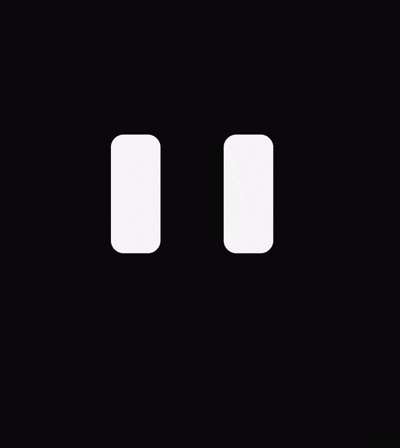
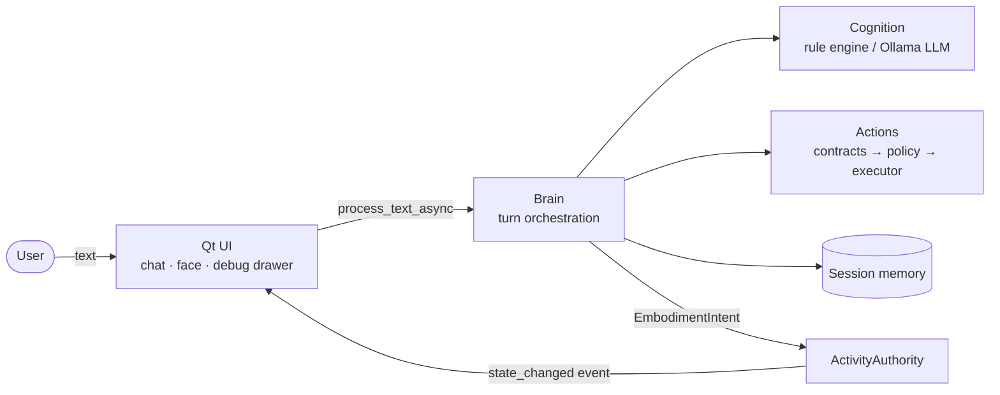

# M.I.R.A.

M.I.R.A. is a **software-first embodied assistant prototype** built in Python
and PySide6: a compact desktop companion with an expressive animated face, text
chat, modular cognition, and safe local desktop actions.

Rather than starting from motors and sensors, the project first develops the
interaction and behavioral core of a future robotic assistant: how an agent
receives input, interprets it, chooses an action, responds, and visibly
expresses what it is doing.

<p align="center">
  
</p>

## Current capabilities

- **Expressive face**: procedurally animated eyes with blinking, idle motion,
  cursor-aware gaze, thinking drift, speaking pulse, and smooth transitions
  between idle, listening, thinking, speaking, happy, and confused expressions.
- **Text interaction**: a compact chat panel. The face reacts to focus,
  typing, processing, and responses.
- **Modular cognition**: a deterministic rule-based intent engine by default,
  or an optional local LLM engine through [Ollama](https://ollama.com). The LLM
  path validates every model proposal and falls back to the rules when the
  model is unreachable or returns unusable output.
- **Session memory**: recent conversation and the last intent, kept for the
  current session only.
- **Local actions**: time and date, session introspection, opening URLs,
  applications, and allowed directories, notifications, and system info. Every
  action passes an explicit execution policy. Actions that require confirmation
  are blocked because no confirmation flow exists yet.
- **Debug drawer**: hidden by default. It offers live tuning of expression
  geometry, animation, and blink parameters, with save/reload of the profile
  file.

Current scope: the rule engine and built-in replies are in **Italian**, and
desktop actions target **Linux** (`xdg-open`, `notify-send`). There is no voice,
camera, persistent memory, or hardware integration.

## Architecture

The package is split into layers with an enforced dependency direction: a
technology-independent domain, session memory, messaging, actions, cognition,
core orchestration, adapters, an explicit composition root, and a Qt UI. One
component, `ActivityAuthority`, commits embodiment state. The face renders
immutable, renderer-independent frames.



Intent inference runs off the UI thread. Actions, memory updates, and events
happen only when the result is committed on the UI thread, and stale results
are discarded. Details: [docs/architecture.md](docs/architecture.md).

## Quick start

Requires Python 3.12 on Linux. Ollama is needed only for LLM mode.

```bash
git clone https://github.com/ErikMischiatti/H.A.R.O..git M.I.R.A.
cd M.I.R.A.
python3.12 -m venv venv
venv/bin/python -m pip install --requirement requirements.txt

venv/bin/python -m mira.main                          # rule-based engine
MIRA_INTENT_ENGINE=llm venv/bin/python -m mira.main   # local Ollama engine
```

Try messages such as `ciao`, `che ore sono`, `cosa sai fare`, or
`apri cartella download`.

LLM mode uses `llama3.2:3b` at `http://localhost:11434` by default. See
[docs/configuration.md](docs/configuration.md) for all settings. To launch from
any directory, link `bin/mira` onto your `PATH` as described in
[docs/development.md](docs/development.md#launcher).

## Development

```bash
venv/bin/python scripts/check_layering.py
venv/bin/python scripts/check_state_authority.py
QT_QPA_PLATFORM=offscreen venv/bin/python -m pytest
```

The complete validation baseline, test organization, and dependency workflow
are in [docs/development.md](docs/development.md).

## Documentation

| Document | Contents |
|---|---|
| [docs/architecture.md](docs/architecture.md) | Layers, composition, interaction flow, messaging, cognition, actions, embodiment, lifecycle |
| [docs/configuration.md](docs/configuration.md) | Environment variables, LLM fallback diagnostics, expression profiles, desktop actions |
| [docs/development.md](docs/development.md) | Setup, launcher, validation, tests, dependency updates, conventions |
| [mira/AGENTS.md](mira/AGENTS.md) | Rules for contributors and coding agents working in the codebase |
| [docs/MIRA_technical_analysis.md](docs/MIRA_technical_analysis.md) | Historical, non-normative snapshot (Italian, 2026-06-28) |

## Project status

M.I.R.A. is an active software prototype, and the Foundation v1 architecture
baseline is complete. Next steps focus on the embodied experience and
cognition: richer face motion, better integration between cognitive output and
expression, lower LLM latency, and an action confirmation flow.

The longer-term direction includes voice interaction, richer context memory,
visual presence awareness, and eventually physical embodiment on a robotic
platform. None of these exist yet. The architecture's planned extension points
are listed in [docs/architecture.md](docs/architecture.md#13-intended-future-boundaries-not-implemented).

## Author

**Erik Mischiatti**, M.Sc. Mechatronics Engineering

## License

MIT. See [LICENSE](LICENSE).
